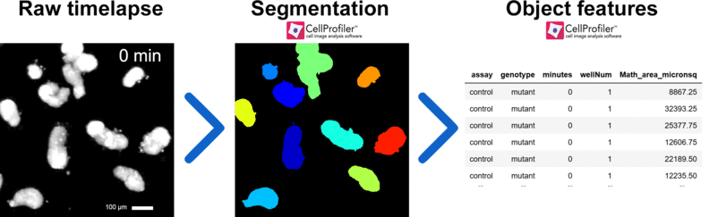
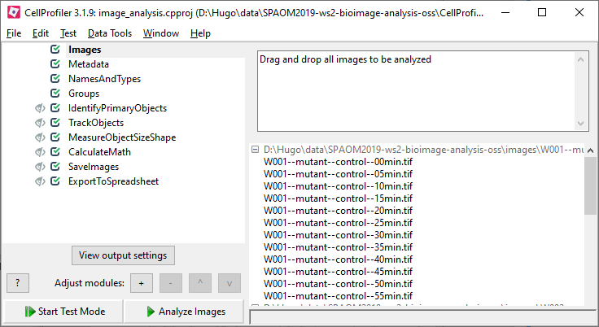

Jupyter Notebook
Untitled Last Checkpoint: 16 minutes ago (unsaved changes) Current Kernel Logo

R

    File
    Edit
    View
    Insert
    Cell
    Kernel
    Help

# SPAOM 2019 WS2: Bioimage analysis open-source software tools

​

## Image processing with CellProfiler

​

​

​

CellProfiler is an open source image analysis software which aims at enabling biologists without training in computer vision or coding to quantitatively analyze a large number (thousands) of images. It is commonly used in multiplexed cell-based assays, such as high-content screening (HCS). There are CellProfiler versions for Windows, mac OS and cluster environments.

​

This exercise uses CellProfiler [version 3.1.9.](https://cellprofiler.org/releases/)

​

**Reference:** McQuin C, Goodman A, Chernyshev V, Kamentsky L, Cimini BA, Karhohs KW, Doan M, Ding L, Rafelski SM, Thirstrup D, Wiegraebe W, Singh S, Becker T, Caicedo JC, Carpenter AE (2018). CellProfiler 3.0: Next-generation image processing for biology. PLoS Biol. 16(7):e2005970 / doi. PMID: 29969450

​

​

## Table of Contents

* [1. Goal](#goal)

* [2. Getting started](#gettingstarted)

* [3. Performing image analysis](#performingimageanalysis)

  * [3.1. Open CellProfiler](#open)

  * [3.2. Load images](#loadimages)

  * [3.3. Extract metadata](#extractmetadata)

  * [3.4. Define image sets](#namesandtypes)

  * [3.5. Define time lapse](#groups)

  * [3.6. Test mode: run CellProfiler interactively](#testmode)

  * [3.7. Identify organoids with IdentifyPrimaryObjects](#IdentifyPrimaryObjects)

  * [3.8. Tracking organoids using TrackObjects](#TrackObjects)

  * [3.9. Measuring organoid size with MeasureObjectSizeShape](#MeasureObjectSizeShape)

  * [3.10. Converting size units with CalculateMath](#CalculateMath)

  * [3.11. Save images using SaveImages](#SaveImages)

  * [3.12. Saving numeric results using ExportToSpreadsheet](#ExportToSpreadsheet)

  * [3.13. Selecting where to save data to](#defaultoutputfolder)

  * [3.14. Run your pipeline](#run)

* [4. Data analysis](#dataanalysis)

​

​

## <a name="goal">1. Goal</a>

​

In this exercise we will use CellProfiler to:  

* Segment fluorescently-labeled organoids

* Measure their cross-sectional area

* Track objects across time frames

* Record metadata regarding the experimental conditions affecting each individual organoid.

* Save results in a text file which can be opened in a variety of programs such as R or spreadsheet software.

​

​

​

## <a name="gettingstarted">2. Getting started:</a>

* Install CellProfiler

* Download [this repository](https://github.com/hmbotelho/SPAOM2019-ws2-bioimage-analysis-oss) as zip file.

* Extract the zip file

* Locate the raw microscopy images (folder `images`)

* Locate the CellProfiler projet (`CellProfiler/image_analysis.cpproj`).

​

​

## <a name="performingimageanalysis">3. Performing image analysis</a>

​

​

### <a name="open">3.1. Open CellProfiler</a>

* Double click the `image_analysis.cpproj` file to open it in CellProfiler.

* The CellProfiler window has 2 main regions:

    * **Left:** the sequence of operations  to be performed on each image set (modules)

    * **Right:** the settings of the currently selected module

​

​

* New modules can be inserted into the pipeline by right clicking the left modules region, or by selecting `Adjust modules` > `+` near the bottom of the window. For this exercise all modules have already been added to the pipeline.

​

​

### <a name="loadimages">3.2. Load images</a>

The `images` module already lists some images but they will most likely be located elsewhere in your computer.

* To clear the images, right click on the image list and select `Clear File List`. Alternatively, select all and hit `delete`.

* Drag raw images (folder `images`) to the white box named with `Drop files and folders here`. The filenames in the folder should now appear in the panel. You can take a look at the images by double-clicking on the name in the file list (close afterwards).

​

​

### <a name="extractmetadata">3.3. Extract metadata</a>

Image names contain useful informations to describe the experiment and deal with the time lapse, which we would like to record.

* Select the `Metadata` module.

* In `Extract metadata` select `Yes`.

* In `Metadata extraction method`select `Extract from file/folder names`.

* In `Metadata source` select `File name`.

* In `Extract metadata from` select `All images`.

* In `Regular expression`write the following:

`^(?P<expname>.*)--W(?P<wellNum>.*)--(?P<genotype>.*)--(?P<assay>.*)--(?P<minutes>.*)min\.tif`

* This expression allows storing fragments of each file name in internal CellProfiler variables (wellNum, minutes, and so on).

* Click `Update` at the bottom of the table to see which information is being captured for each file.

​

​

### <a name="namesandtypes">3.4. Define image sets</a>

We need to tell CellProfiler what the image file name looks like. This is especially useful in experiments with multiple fluorescence channels.

* Select the `NamesAndTypes` module.

* Assign a name (*e.g.* `raw_data`) to all images.

* Select `2D` and `Grayscale image`.

* Click `Update` at the bottom of the table to list the selected files.

​

​

### <a name="groups">3.5. Define time lapse</a>

We need to let CellProfiler know that all images coming from the same well belong to the same time lapse movie.

* Select the `Groups` module.

* Group by the `wellNum` metadata field you captured in the metadata module.

* You will see that CellProfiler found 6 image groups (*i.e.* wells), each one with 12 images.

​

​

### <a name="testmode">3.6. Test mode: run CellProfiler interactively</a>

The test mode allows you to select an image (or image set) and examine the outcome at each module.

* Click `Start test mode`.

* Click `Window` > `Show all windows on run`. The open eyes icons indicate that CellProfiler will display the outcome after running each module.

* You may rum test mode on any image of the dataset by selecting `Test` > `Choose image set` (select a different time point) or `Test` > `Choose image group` (choose a different well). 

​

​

### <a name="IdentifyPrimaryObjects">3.7. Identify organoids with IdentifyPrimaryObjects</a>

The first step in the analysis pipeline is to segment organoids.

* Select the `IdentifyPrimaryObjects` module.

* Select `Advenced settings`.

* Select the input image: `raw_data`.

* Segment with a `Global` thresholding using the `Otsu` algorithm.

* Do not `discard objects touching the border of the image`.

* Name the primary objects to be identified: `organoids`

* Click `Step` to see the segmentation results (connected component analysis).

* If you change any setting, click `step` again.

​

It may be challenging to find setting that accurately segment all objects in a set of images. Optimized parameters for thresholding, size exclusion and declumping have been inserted in this module.

​

​

### <a name="TrackObjects">3.8. Tracking organoids using TrackObjects</a>

With this module CellProfiler can assign the same label to each organoid across the entire time lapse. In practice, obtaining accurate results is not straightforward because organoids have irregular (and changing) shapes and can  touch each other (but nor fuse) when they swell.

​

* Select the `TrackObjects` module.

* Select the `Overlap` tracking method. This is the best for cases where objects do not move significantly across time frames. Let us allow for a maximum of `10 pixel` distance between frames.

* In `Select the objects to track` select `organoids`

* Select `Filter using a minimum lifetime` of `11`. This means that any organoid which is not found on all 12 time lapse frames will lose its label. This is useful in the post-processing stage to exclude organoids which may not be accurately tracked (we thereby assure that we will be measuring organoid swelling and not the appearance/disappearance of organoids from images).

* Name the tracked objects `organoids_tracked`.

​

​

### <a name="MeasureObjectSizeShape">3.9. Measuring organoid size with MeasureObjectSizeShape</a>

The goal of this image analysis exercise is measure object area.

​

* Select the `MeasureObjectSizeShape` module.

* Measure the `organoid` objects.

* Do not calculate Zernike features

​

This module will compute many morphological parameters. We are only interested in one or them: the area. This comes in units of pixel2. In the next module we will convert these units into μm2.

​

​

### <a name="CalculateMath">3.10. Converting size units with CalculateMath</a>

This module performs arithmetic operations on object features.

To convert the pixel2 area values into μm2 one just has to multiply the pixel2 measurement by the square of the image pixel pitch. In this example, this is 1.5μm2=2.25

​

* Select the `CalculateMath` module.

* Name the result of the operation as `area_micronsq`.

* In `operation` select `None`.

* Select the numerator objects `organoids` and the `AreaShape` > `Area` feature.

* On `Multiply the above operand by` insert `2.25`.

* Leave all other operations neutral.

​

This is all we need to measure. All further modules will only deal with saving/exporting results.

​

​

### <a name="SaveImages">3.11. Save images using SaveImages</a>

It is important to save the outcome of the segmentation (and tracking) steps in order to judge the results quality without having to run the CellProfiler test mode on all images.  

Image file names can use the metadata fields previously recorded. We will use this information to save segmentation label images in a folder structure identical to the raw data.

​

* Select the `SaveImages` module.

* Save an `Image` with the `organoids_tracked` objects.

* Save as a `16-bit integer` image

* Let us save these images in a `Default Output Folder sub-folder` with the following structure:

`expname`**--cellprofiler/W**`wellNum`**--**`genotype`**--**`assay`  

​

To add the `metadata` fields, right-click on the **Sub-folder** field and select the appropriate metadata field from the list.

​

​

### <a name="ExportToSpreadsheet">3.12. Saving numeric results using ExportToSpreadsheet

This module saves text files with image and/or object features and metadata.</a>

​

* Selec the `ExportToSpreadsheet` module.

* Chose `Comma` as delimiter.

* On `Output file location` select `Default Output Folder sub-folder` using  metadata fields as before:

`expname`**--cellprofiler**

* Enable `Add image metadata columns to your object data file`.

* Click on `Yes` for `Select the measurements to export`. Select the following fields:

    * `Image > Metadata > assay`

    * `Image > Metadata > expname`

    * `Image > Metadata > genotype`

    * `Image > Metadata > minutes`

    * `Image > Metadata > wellNum`

    * `organoids > Math > area > micronsq`

    * `organoids > TrackObjects > Label > 10` 

* Since we only need object-based measurements, select `Export all measurement types` > `No` > `organoids` and `objects.csv` as file name.

* Save the project before proceeding.

​

CellProfiler is able to extract many object and image features. In most cases, many features are not required for the scientific goal, or are intermediate measurements which need not be exported. Minimizing the amount of exported features may greatly simplify subsequent data analyses.

​

​

### <a name="defaultoutputfolder">3.13. Selecting where to save data to

The `Default output folder` is the most common convenient way to save most analysis results.</a>

​

* At the bottom left of the CellProfiler interface, click `View output settings`.

* In the panel to the right, adjust the `Default Output Folder` (*e.g.* create a new folder to save the analysis results. 

​

​

### <a name="run">3.14. Run your pipeline</a>

After setting up all parameters (possibly iterating the test mode over several images) one can apply the analysis settings to the entire batch of images.

​

* Select `Exit test mode`

* Select `Window` > `Hide all windows on run`. This will prevent CellProfiler to run in interactive mode during the batch analysis.

* Click `Analyze Images`.

* Wait for the analysis to complete. This may take a few minutes, depending on your computer.

* Running the `image_analysis.cpproj` file with default settings produces the data stored on `CellProfiler/analysis--cellprofiler`.

​

​

## <a name="dataanalysis">4. Data analysis</a>

​

The pipeline will now analyze all the images and create several output files. The file named `organoids.csv` contains image number, object number (object being cell), the area measurement and all metadata information. There is also the label from object tracking. The same physical organoid should have the same label across all time frames. The organoids which are not detected in all time frames are labelled `nan`.

​

Each line in this file represents one object in one time frame. This is relevant information, but one must summarize it to get a global representation of the experimental results.

​

A simple data analysis would compute the sum of the area of all orgaoids in each image, normalize it (*e.g.* area at the initial time point = 100%) and compare swelling across experimental conditions.

​

It is also very important to assess whether the segmentation step worked appropriately across the entire dataset, including for images which were not evaluated under the `Test mode`. These may (or may not) show up as outliers in the analyzed dataset.

​

