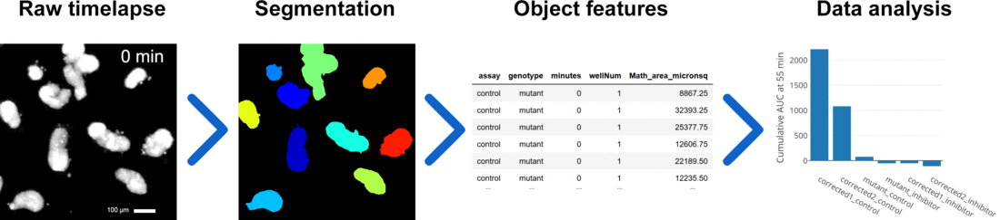
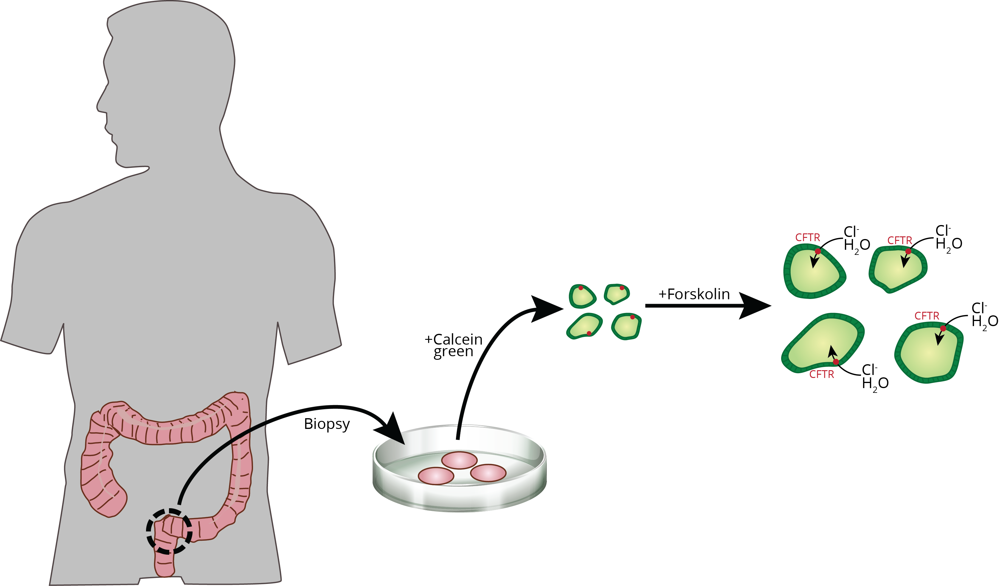
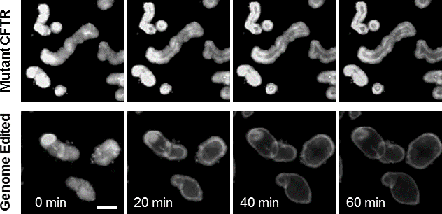
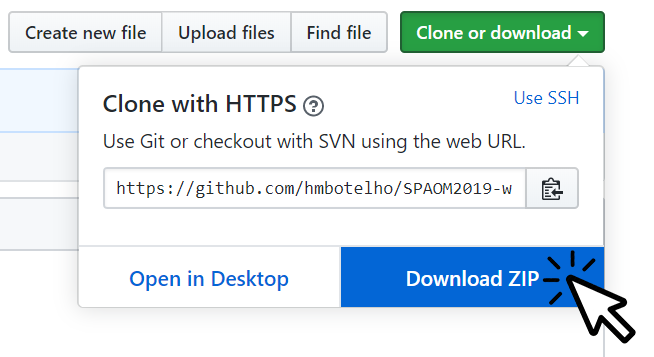

[](https://mybinder.org/v2/gh/hmbotelho/SPAOM2019-ws2-bioimage-analysis-oss/master)

# SPAOM 2019<br>WS2: Bioimage analysis open-source software tools
## Analysis of time lapse microscopy data with CellProfiler _et al_

### Author
- [Hugo M. Botelho](http://webpages.fc.ul.pt/~hmbotelho), Biosystems and Integrative Sciences Institute, University of Lisboa 


In this exercise, you will use the following open source image analysis software to set up an automated image and data analysis pipeline:
* CellProfiler
* Fiji
* KNIME

## Table of Contents
* [1. Summary](#summary)
* [2. Tools](#tools)
* [3. The microscopy assay](#assay)
* [4. The dataset](#dataset)
* [5. Goal](#goal)
* [6. Software installation](#softwareinstallation)


## <a name="summary">Summary</a>

The image and data analysis pipeline you will use performs the following tasks:

1. Segment individual intestinal organoids in a time-lapse fluorescence experiment;  
2. Measure cross-sectional organoid area;  
3. Track organoids across frames;  
4. Ignore organoids which can not be reliably measured:  
    * Organoids touching image borders
    * Organoids whose segmentation fails in some frames
5. Summarize and normalize measurements;  
6. Report results as a plot.  




## <a name="tools">2. Tools</a>

The problem will be tackled with 4 different open source software tools:  

* Image processing was perormed on [CellProfiler](https://cellprofiler.org/), [Fiji/ImageJ](http://fiji.sc/) and [KNIME](https://www.knime.com/).  
* Data analysis was performed on [R](https://cran.r-project.org/) or [KNIME](https://www.knime.com/).  

Step-by-step details on the analysis process are available as web pages or Jupyter notebooks. Click the links to open the sections referring to image processing and data analysis.

* **CellProfiler**
    * Image processing [[web](CellProfiler/01_CellProfiler_image_processing.md)]
    * Data analysis [[web](CellProfiler/02_CellProfiler_data_analysis.md)][[notebook](CellProfiler/02_CellProfiler_data_analysis.ipynb)][](https://mybinder.org/v2/gh/hmbotelho/SPAOM2019-ws2-bioimage-analysis-oss/master)

* **Fiji**
    * Image processing [[web](Fiji/01_Fiji_image_processing.md)]
    * Data analysis [[web](Fiji/02_Fiji_data_analysis.md)][[notebook](Fiji/02_Fiji_data_analysis.ipynb)][](https://mybinder.org/v2/gh/hmbotelho/SPAOM2019-ws2-bioimage-analysis-oss/master)

* **KNIME**
    * Image and data analysis [[web](KNIME/01_KNIME.md)]

*Software installation instructions [below](#softwareinstallation)*


## <a name="assay">3. The microscopy assay</a>

Cystic Fibrosis (CF) is a disease caused by mutations in the CFTR gene. CFTR is a chloride channel and, thus, one can assess its activity *in vivo* by observing its effect in osmotic processes, such as in the Foskolin-Induced Swelling (FIS) assay:  



The FIS assays uses intestinal organoids obtained from biopsies from healthy or CF individuals. When CFTR activity is stimulated with the compound forskolin, organoids uptake chloride and water into their lumen/interior. In a time lapse microscopy experiment, organoids thus swell in a manner proportional to CFTR activity. Certain CFTR mutations or CFTR inhibitors impair the swelling phenotype. The FIS assay is a screening tool to search for strategies to rescue CFTR mutations, such as by correction of the *cftr* chromosomal locus with CRISPR/Cas9.  


 Scale bar = 100 μm

Detailed information about the assay: [Dekkers *et al* (2013) Nature Medicine 19, 939-945](http://www.nature.com/nm/journal/v19/n7/full/nm.3201.html)  


## <a name="dataset">4. The dataset</a>

This exercise includes a FIS dataset obtained with fluorescently-labelled organoids laid out in a multi-well plate as follows:  

Well | Sample
---|---
1 | CFTR (Mutant)
2 | CFTR (corrected clone 1)
3 | CFTR (corrected clone 2)
4 | CFTR (Mutant) + Inhibitor
5 | CFTR (corrected clone 1) + Inhibitor
6 | CFTR (corrected clone 2) + Inhibitor

This is a short description of the dataset:   

* 6 experimental conditions (*i.e.* wells)
* 12 time points per well (0, 5, 10, ... 55 min)
* 72 images (total)
* 40 Mb
* Bit depth: 16 bit
* Image size: 540 x 540 x 1 voxels
* Image dimensions (xy): 810 x 810 μm
* Pixel dimensions (xy): 1.5 x 1.5 μm

Data source: [Schwank *et al* (2013) Cell Stem Cell 13(6) 653-658](http://www.sciencedirect.com/science/article/pii/S1934590913004931)  

 

## <a name="goal">5. Goal</a>

Determine which of the 2 corrected clones produced the best swelling (*i.e.* CFTR correction).


## <a name="softwareinstallation">6. Software installation</a>
Click headers to show installation instructions.  


<details>
    <summary><strong>Dataset</strong></summary>
  
  1. Download the contents of this repository [https://github.com/hmbotelho/SPAOM2019-ws2-bioimage-analysis-oss) by clicking the `Clone or download` > `Download zip`.
  { width=100% }
  2. Unzip file
</details>


<details>
    <summary><strong>Web Browser</strong></summary>
  
  A web browser is required to run Jupyter notebooks. Any browser should work, but some interactive features will only be available on [Mozilla Firefox](https://www.mozilla.org/firefox).
</details>


<details>
    <summary><strong>CellProfiler</strong></summary>
  
  The data in this repository was analyzed with CellProfiler version 3.1.9.
  1. Download Cellprofiler from [https://cellprofiler.org/releases/](https://cellprofiler.org/releases/). Select the version matching your operating system. Note: "CellProfiler Analyst" is a different program, which is not used in this tutorial.
  2. Install.
</details>


<details>
    <summary><strong>Jupyter Notebooks</strong></summary>
  
  This is only required if you want to run Jupyter notebooks locally. Otherwise, just click on the icon on the top of this document: 
  1. Download and install Anaconda from [https://www.anaconda.com/distribution/](https://www.anaconda.com/distribution/)
  2. Run terminal (MacOS) or Anaconda Prompt (Windows)
  3. Change the working directory to the one with the unzipped repository contents, _e.g._:
    ```cd c:/users/myname/SPAOM2019```
  4. Create a new R conda environment with all requiredpackages built from CRAN:
    ```conda create -n SPAOM2019 r-essentials r-base r-plotly```
  5. Enter `yes`/`y` if asked about installing R packages
  6. Activate the environment
    ```conda activate SPAOM2019```
  7. Start a new notebook with:
    ```jupyter notebook```
  8. The notebook should open in the default web browser. [Mozilla Firefox](https://www.mozilla.org/firefox) is recommended.
  9. Double click `.ipynb` files to open them it.
</details>


<details>
    <summary><strong>KNIME</strong></summary>
  
  The data in this repository was analyzed with KNIME Analytics Platform version 4.0.2.
  1. Download KNIME Analytics Platform [https://www.knime.com/downloads/download-knime](https://www.knime.com/downloads/download-knime)
  2. Install
  3. Run KNIME.
  4. Install KNIME image processing plugins:
    1. Click on `File` > `Install KNIME Extensions...`
    2. Select `KNIME Community Contributions - Imaging`
    3. Follow the wizard and install
  5. Install KNIME CellProfiler and ImageJ extensions:
    1. Click on `Help` > `Install New Software`
    2. Click on `Manage...`
    3. Under `Install/Update` > `Available software sites` activate `KNIME Communnity Extensions (Experimental)`
    4. Click on `Apply and Close` and install the extensions
    5. On the KNIME main window click on `File` > `Install KNIME Extensions...`
    6. Under `KNIME Community Extensions - Image Processing and Analysis` select:
      * CellProfiler
	  * ImageJ
	  * Python
    7. Follow the wizard to install the extensions.
</details>
